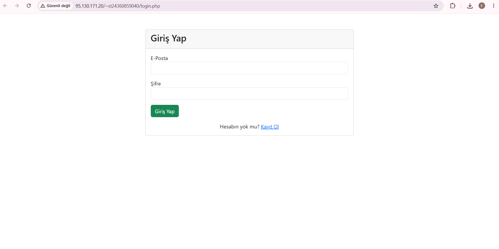
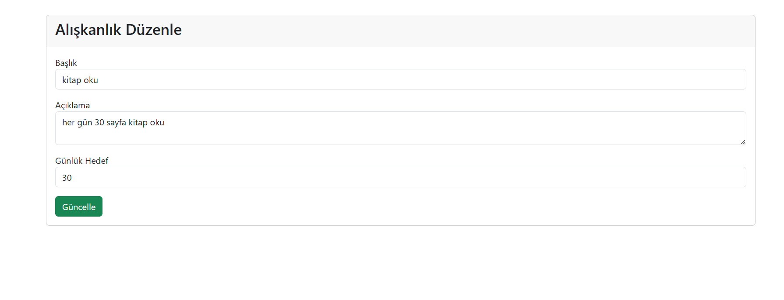
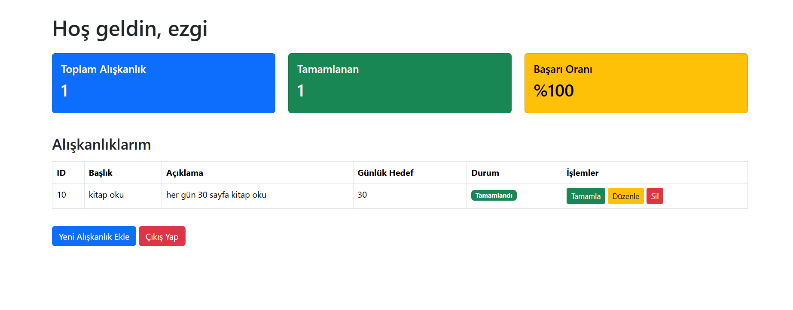

# Mikro Hedef ve Alışkanlık Takip Sistemi

## 📌 Proje Açıklaması
Bu proje, kullanıcıların kayıt olup giriş yaptıktan sonra kendi mikro hedeflerini ekleyebildiği, güncelleyebildiği, silebildiği ve listeleyebildiği web tabanlı bir uygulamadır.

Sistem, kullanıcıların günlük alışkanlıklarını takip etmelerini ve düzenli hedefler oluşturmasını amaçlamaktadır.

## ✨ Proje Özellikleri

- Kullanıcı kayıt sistemi ile yeni hesap oluşturulabilir.
- Kullanıcı giriş ve çıkış (session) sistemi ile güvenli oturum yönetimi sağlanır..
- Kullanıcılar sisteme giriş yaptıktan sonra yeni alışkanlık ekleyebilir.
- Eklenen hedefler liste halinde görüntülenebilir.
- Kullanıcılar ekledikleri hedefleri tamamlandı olarak işaretleyebilir
- İstenmeyen hedefler silinebilir.
- Mevcut hedefler düzenlenebilir .

  ## 💻 Kurulum
Projeyi çalıştırmak için XAMPP kullanıldı. Ben projeyi geliştirirken tüm dosyaları htdocs klasörü altındaki habit_tracker klasörüne koyarak çalıştım. XAMPP’ı açıp Apache ve MySQL servislerini başlattıktan sonra tarayıcıdan http://localhost/habit_tracker adresine girerek projeyi test ettim.
Veritabanı tarafında ise phpMyAdmin üzerinden bir veritabanı oluşturdum ve gerekli tabloları SQL dosyası ile içeri aktardım. Eğer aynı şekilde kurulursa proje sorunsuz şekilde çalışacaktır.

## Canlı Demo
## 🌐 Canlı Demo

[Canlı Siteyi Aç](http://95.130.171.20/~st24360859040/login.php)

## 🎥 Tanıtım Videosu
Projenin nasıl çalıştığını gösteren 1-3 dakikalık bir tanıtım videosu hazırlanmıştır. Video linki aşağıdadır.
[YouTube Demo Videosu](https://youtu.be/nsfS0fqe5iY)

## 📸 Ekran Görüntüleri

### Giriş Yapma Ekranı

### Düzenleme Ekranı

### Sistem Görüntüsü

## Hazırlayan
Ezgi Bigez
